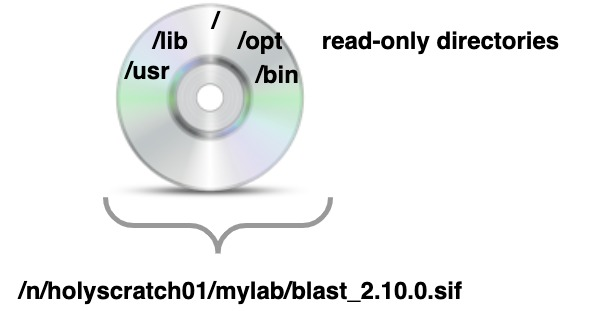
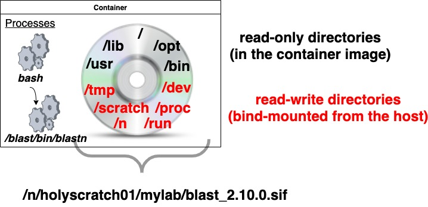
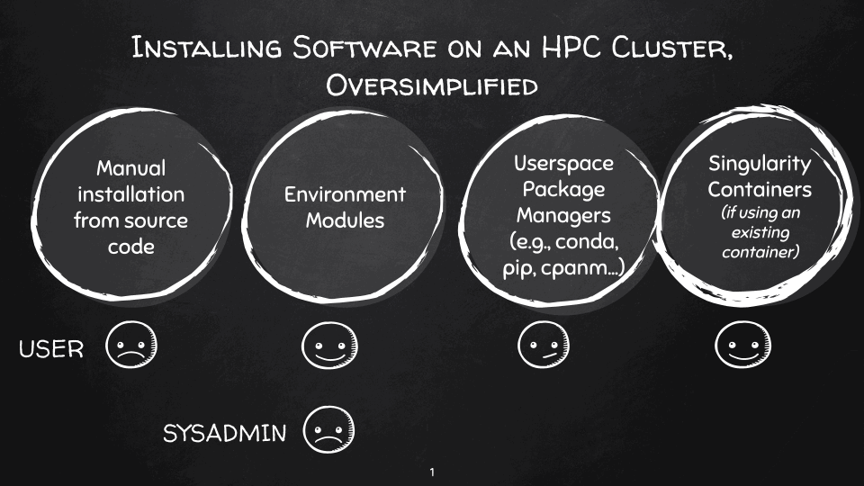
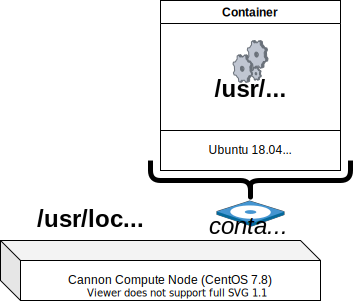

class: middle, center

# Singularity
## Finding & Using Containers
### FAS Bioinformatics Workshop
#### April 27, 2021

#### Your Host: Nathan Weeks

---

# Roadmap

### Part 1 (this presentation)

* What are (Singularity) containers?
* Finding container images
* Using Singularity on Cannon

### Part 2 (next week)

* Building Singularity container images
* Common pitfalls
* Useful tips & tricks

---

### Prerequisites (to follow along with the exercises)...

1. Log into Cannon (either via [SSH](https://docs.rc.fas.harvard.edu/kb/terminal-access/), or a web browser using the [FASRC VDI portal](https://docs.rc.fas.harvard.edu/kb/virtual-desktop/) ([FASRC VPN](https://docs.rc.fas.harvard.edu/kb/vpn-setup/) connection required)

2. Launch an [interactive job](https://docs.rc.fas.harvard.edu/kb/running-jobs/#Interactive_jobs_and_salloc) on a compute node:
```
      salloc -p test,shared -t 2:00:00 --mem=4g
```
    *NOTE:* the `singularity` *command is not available on Cannon login nodes*


---

# What is a *container*?

A set of one or more processes (*running programs*) that share (at least<!-- <sup>1</sup> -->) a different root file system ("/"; usually provided by a *container image*) than processes running outside of the container on the same host operating system kernel (*typically Linux*).

---

# What is Singularity?
* An open-source container platform for Linux
  - https://github.com/hpcng/singularity
  - [Old beta for macOS](https://sylabs.io/singularity-desktop-macos/) (don't bother)
* Started in 2015 by Greg Kurtzer from Lawrence Berkeley National Laboratory; now commercially developed/supported by [Sylabs](https://sylabs.io/)
* Provides software tooling for both building *container images* and creating *containers* in which commands are run
* Used:
  - Primarily for HPC clusters
    - Cannon: [FASRC VDI portal](https://docs.rc.fas.harvard.edu/kb/virtual-desktop/) (Open OnDemand) to run JupyterLab, RStudio Server, and other interactive apps
  - Workflow management systems, such as [Snakemake](https://snakemake.readthedocs.io/en/stable/snakefiles/deployment.html#running-jobs-in-containers), [NextFlow](https://www.nextflow.io/docs/latest/singularity.html), and [Galaxy](https://docs.galaxyproject.org/en/master/admin/special_topics/mulled_containers.html)
  - [Open Science Grid](https://support.opensciencegrid.org/support/solutions/articles/12000024676-docker-and-singularity-containers)

---

# Singularity Image

* A Singularity *image* is a file containing a (compressed, read-only [SquashFS](https://en.wikipedia.org/wiki/SquashFS)) file system, usually containing:
  * A base (Linux) operating system (e.g., Ubuntu, CentOS, Alpine)
  * Target software (e.g., NCBI BLAST+) and all software dependencies
* Typical file extension: *.sif* ([Singularity Image Format]()); older (pre Singularity 3.x) may use ".simg"
* Since it's a *file*, can be copied to other hosts (e.g., `scp`), or archived/shared (e.g., alongside code and research data)


---

# Singularity Container

* A Singularity *container* runs user processes with a software environment reflecting the (read-only) file system within the Singularity image file, plus select (generally-writable) directories from the host that are *bind-mounted*  onto this file system.
  * On Cannon, this includes **/n/** (network) file systems, like **/n/holyscratch01** and **/n/home* **



---

# Why use containers?



---

# Why use containers?
* Save time
  - (Re)creating a complex software environment on a different host can be difficult
* Portability
  - A container image can run on another (Linux) host, or...
  - Easily shared with other users on the same system (e.g., on Cannon with other members of the same lab)
* Reproducibility
  - Guarantees software environment (including exact versions) recorded & reproduced faithfully

#### SEE ALSO
* [Introduction to Singularity - Use Cases](https://sylabs.io/guides/3.7/user-guide/introduction.html#use-cases)

---

## Example: [Trinity](https://trinityrnaseq.github.io/) de novo transcriptome assembler

* Difficult to install; many software dependencies
  - Bespoke environment modules for a couple older versions exist on Cannon (see `module-query trinityrnaseq`)
* "Official" *container image* encapsulates Trinity & dependencies (see the [Dockerfile](https://github.com/trinityrnaseq/trinityrnaseq/blob/v2.12.0/Docker/Dockerfile) container image "recipe")
  - Can be used on Cannon

<div style="text-align: center"></div>

---

## Running a command in a Singularity container

[singularity exec](https://sylabs.io/guides/3.7/user-guide/quick_start.html#executing-commands) is the most common mechanism to run a command in singularity container, both for batch and interactive jobs:

```
singularity exec [...options...] singularity_image.sif command [...command arguments...]
```

e.g.:

```
$ image=/n/singularity_images/informatics/braker2/braker2_2.1.6.sif 
$ singularity exec ${image} which braker.pl
/usr/local/bin/braker.pl
$ singularity exec ${image} braker.pl --version
braker.pl version 2.1.6
```

*NOTE: It is good practice to use the `singularity exec --cleanenv` option; this will be discussed in more detail in part 2*

---

## Running a command in a Singularity container
[singularity shell](https://sylabs.io/guides/3.7/user-guide/quick_start.html#shell) is used to get a "shell" in the container (almost like logging into a virtual machine) for interactive exploration and (short) interactive work:

```
$ singularity shell /n/singularity_images/informatics/maker/maker:3.01.03-repbase.sif
Singularity> type maker
maker is /usr/local/bin/maker
Singularity> cat /etc/os-release
PRETTY_NAME="Debian GNU/Linux 8 (jessie)"
NAME="Debian GNU/Linux"
VERSION_ID="8"
VERSION="8 (jessie)"
ID=debian
HOME_URL="http://www.debian.org/"
SUPPORT_URL="http://www.debian.org/support"
BUG_REPORT_URL="https://bugs.debian.org/"
```

*The shell prompt changes to `Singularity>` to indicate the shell is in a container*

---

## Your Turn

1. Start a shell in an NCBI BLAST container using the `singularity shell` command:

    ```
    singularity shell /n/singularity_images/informatics/ncbi-blast/ncbi-blast:2.10.0.sif
    ```

2. Answer the following questions:
    1. What is the base operating system of the container image?
       (*hint*: `cat /etc/os-release`)
    2. Where is the location of the `blastn` executable?
       (*hint*: `type blastn` or `which blastn` or `command -v blastn`)

---

## Finding Container Images - Container Registries

* Container images are typically hosted in a *container registry*
  - Hosting service for  container *repositories*, analogous to git repositories
* Many container registries have bad (or no) search interfaces, and may not be your first stop when looking for container images
  - Notable possible exception: NVIDIA GPU Accelerated Container Registry (NGC) for GPU-accelerated container images
 
---

## Singularity container registries

1. (*Update: now defunct?*) Singularity Hub (https://singularity-hub.org/)
  - The first Singularity container registry
  - Requires(d) exessive privileges to your GitHub account to be able to search / use
2. Sylabs Cloud Library (https://cloud.sylabs.io/library)
  - [singularity search](https://sylabs.io/guides/3.7/user-guide/cli/singularity_search.html) command can be used to search---but is not too useful (except for custom-built images)

---

### Container Registries - Docker / OCI (Open Container Image)

Singularity can build SIF images from Docker / OCI images in container other registries.
The most popular:

* DockerHub
  - https://hub.docker.com/
  - The original and most popular (public) container registry
  - [Image "pull" limits](https://www.docker.com/increase-rate-limits)
    - 100 anonymous image pulls per 6 hours per public IP address
    - 200 anonymous images pulls per (free) Docker account (see [singularity remote login](https://sylabs.io/guides/3.7/user-guide/cli/singularity_remote_login.html) to authenticate)
* Quay
  - https://quay.io/search
      - *Caveat: looks like search will required RedHat SSO on July 1, 2021...*

---


## Other OCI Container Registries

* GitHub Container Registry
  - https://docs.github.com/en/packages/guides/about-github-container-registry
  - Newish, but looks promising for continuous integration / automated builds of GitHub-hosted projects
* GitLab Container Registry
  - https://docs.gitlab.com/ee/user/packages/container_registry/
  - More mature than GitHub Container Registry; images hosted per-project / repository
* NVIDIA GPU Accelerated Container Registry (NGC)
  - https://ngc.nvidia.com/
  - singularity `--nv` option to use host GPU in container
    (see Singularity [GPU Support (NVIDIA CUDA & AMD ROCm](https://sylabs.io/guides/3.7/user-guide/gpu.html))

---

## Other OCI Container Registries

Mainly for paying customers:
* Azure Container Registry
  - https://azure.microsoft.com/en-us/services/container-registry/
  - Hosts some "native" Singularity images
* Amazon Elastic Container Registry (ECR)
  - https://gallery.ecr.aws/
* Oracle Container Registry
  - https://container-registry.oracle.com/

---

# BioContainers

* [Bioconda](https://bioconda.github.io/) is a bioinformatics-focused channel of software packages for the [conda](https://docs.rc.fas.harvard.edu/kb/python/) package manager
  - See earlier [conda tutorial](https://github.com/harvardinformatics/bioinformatics-coffee-hour/blob/master/taste-of-conda/index.ipynb)
* [BioContainers](https://biocontainers.pro/) provides container images for (mostly) [Bioconda](https://bioconda.github.io/) packages (including dependencies)
* Can search for BioContainers images:
  - [BioContainers registry](https://biocontainers.pro/registry)
  - [Bioconda Package Index](https://bioconda.github.io/conda-package_index.html)
    - Click on a package name > "container" link > tag > Fetch Tag (download icon)

---

## Generating a Singularity image from a Docker image

Many container registries assume [Docker](https://docker.com), and suggest syntax like:

```
docker pull registry/user/repository:tag
```

To adapt to Singularity, replace with:

```
singularity pull docker://registry/user/repository:tag
```

### Example

```
singularity pull --disable-cache docker://quay.io/biocontainers/samtools:1.12--h9aed4be_1
```

* *The `--disable-cache` option prevents image layers from being cached in ${HOME}/.singularity/cache*

---
## Finding container images for bioinformatics

Prefer "official" container images provided by the project; e.g.
* Check docs, or for existence of Dockerfile in git repo
* Examples:
  - [Trinity](https://github.com/trinityrnaseq/trinityrnaseq/wiki/Trinity-in-Docker#running-trinity-using-singularity)
```
curl -O https://data.broadinstitute.org/Trinity/TRINITY_SINGULARITY/\
trinityrnaseq.v2.12.0.simg
```
      - FAS Informatics [Best Practices for De Novo Transcriptome Assembly with Trinity](https://informatics.fas.harvard.edu/best-practices-for-de-novo-transcriptome-assembly-with-trinity.html) illustrates optimized use on Cannon
  - [QIIME 2](https://docs.qiime2.org/2021.2/install/virtual/docker/)
      - `singularity pull --disable-cache docker://quay.io/qiime2/core:2021.2`
  - [MultiQC](https://github.com/ewels/MultiQC)
      - https://github.com/ewels/MultiQC
          - Links to: https://hub.docker.com/r/ewels/multiqc
          - `singularity pull --disable-cache docker://ewels/multiqc:1.10.1`
* Existence of Dockerfile doesn't mean an image is avialable in a container registry (like Docker Hub)
  - e.g., [Augustus](https://github.com/Gaius-Augustus/Augustus) provides a Dockerfile, but needs to be built

---

# CernVM-FS (CVMFS)

* https://cernvm.cern.ch/fs/
* Singularity images of Biocontainers (maintained by the Galaxy Project) available at:

```
/cvmfs/singularity.galaxyproject.org/FIRST_LETTER/SECOND_LETTER/\
PACKAGE_NAME:VERSION--CONDA_BUILD
```

ex.

```
$ singularity exec --cleanenv \
  /cvmfs/singularity.galaxyproject.org/b/l/blast:2.11.0--pl526he19e7b1_0 \
  blastn -version
WARNING: Skipping mount /var/singularity/mnt/session/etc/resolv.conf [files]: /etc/resolv.conf doesn't exist in container
blastn: 2.11.0+
 Package: blast 2.11.0, build Mar 12 2021 10:19:58
```

* `/etc/resolv.conf` warning is a known issue:
  https://github.com/bioconda/bioconda-recipes/issues/11583
* https://docs.rc.fas.harvard.edu/kb/singularity-on-the-cluster/#BioContainers

---

# CVMFS Caveats
* Delay (up to a minute or so) when auto-mounting `/cvmfs/singularity.galaxyproject.org` on a given compute node
* Further delay when fetching a container images

## Recommendations
* Don't use for a [large number of jobs](https://docs.rc.fas.harvard.edu/kb/submitting-large-numbers-of-jobs/)
* Copy frequently-used containers to [high-performance shared storage](https://docs.rc.fas.harvard.edu/kb/cluster-storage/#Networked_High-performance_Shared_Scratch_Storage)

---

## Exercise - Biocontainers & CVMFS

1. Choose a Biocontainers image, using your favorite interface:
    * [Bioconda package index](https://bioconda.github.io/conda-package_index.html)
    * [BioContainers Registry](https://biocontainers.pro/registry)

  `ls /cvmfs/singularity.galaxyproject.org/FIRST_LETTER/SECOND_LETTER/`

2. Find the container image in CVMFS, and execute a command in the container

```
singularity exec --cleanenv \
  /cvmfs/singularity.galaxyproject.org/b/l/blast:2.11.0--pl526he19e7b1_0 \
  blastn -version
```

3. Copy & paste the `singularity exec` command into the chat

---

# Miscellanea - Pipelines of Containers

Processes in a Singularity container behave the same as processes on the host outside of a container w.r.t. I/O (including stdin/stdout/stderr).
As such, they can be used with (unix) pipes:

```
singularity pull --disable-cache docker://quay.io/biocontainers/samtools:1.12--h9aed4be_1
singularity pull --disable-cache docker://quay.io/biocontainers/bwa-mem2:2.2.1--h9a82719_1
singularity exec --cleanenv bwa-mem2_2.2.1--h9a82719_1.sif bwa-mem2 index reference.fa.gz 
singularity exec --cleanenv bwa-mem2_2.2.1--h9a82719_1.sif \
                            bwa-mem2 mem reference.fa.gz left.fastq.gz right.fastq.gz |
  singularity exec --cleanenv samtools_1.12--h9aed4be_1.sif \
                              samtools sort --output-fmt bam > output.bam
```

### SEE ALSO

   For a more detailed tutorial on Unix pipes, see [harvardinformatics/bioinformatics-coffee-hour/unix-pipes](https://github.com/harvardinformatics/bioinformatics-coffee-hour/blob/master/unix-pipes/index.ipynb)

--- 

## Links to other useful resources

* Singularity User Guide
  - https://sylabs.io/guides/latest/user-guide/
* Software Carpentries - Introduction to Singularity (alpha)
  - https://carpentries-incubator.github.io/singularity-introduction
* Creating and running software containers with Singularity (originally NIH)
  - https://singulari)ty-tutorial.github.io/
* Singularity Containers for Bioinformatics (Pawsey Supercomputing Centre)
  - https://pawseysc.github.io/containers-bioinformatics-workshop/
* BioContainers Registry: searching for bioinformatics tools, packages and containers
  - https://dx.doi.org/10.1021/acs.jproteome.0c00904
